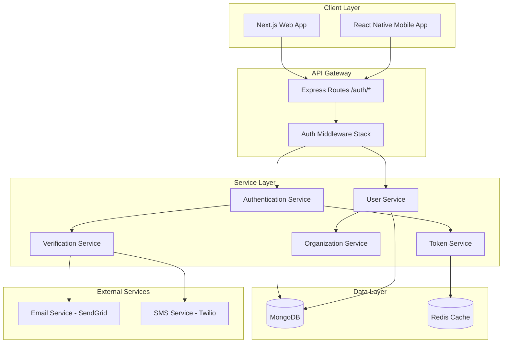
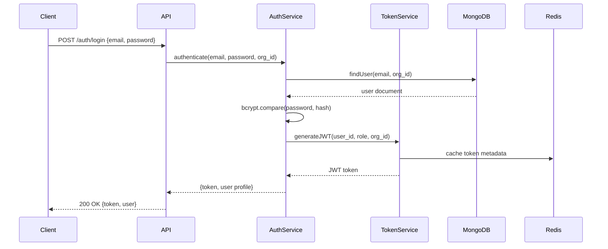

# Design Document: Authentication System

## Overview

The Smart LMS authentication system is a comprehensive, multi-tenant authentication solution built on Node.js/Express with MongoDB. It supports five distinct user roles (Organization Admin, Instructor, Student, Parent, Support Staff) with role-specific registration flows, email/SMS verification, JWT-based authentication, and subdomain-based organization isolation.

The system architecture follows a layered approach:
- **API Layer**: Express routes with Joi validation
- **Service Layer**: Business logic for authentication, verification, and user management
- **Data Layer**: Mongoose models with multi-tenant isolation
- **Security Layer**: JWT generation/validation, bcrypt hashing, rate limiting
- **Integration Layer**: Email (Nodemailer/SendGrid) and SMS (Twilio) services

Key design principles:
- **Multi-tenancy first**: All operations filtered by organization_id
- **Security by default**: HTTPS-only, rate limiting, input validation, secure token storage
- **Async operations**: Email/SMS sent via queues to avoid blocking
- **Stateless authentication**: JWT tokens with Redis-based blacklisting for logout
- **Role-based access**: Permissions enforced at middleware level

## Architecture

### System Components



### Multi-Tenant Architecture

The system uses subdomain-based routing to determine organization context:
- Main site: `smartlms.com` (for Organization Admin signup)
- Org subdomains: `{org-slug}.smartlms.com` (for Student/Parent signup)

Middleware extracts subdomain from request and resolves to `organization_id`, which is then used to filter all database queries.

### Authentication Flow



## Components and Interfaces

### 1. User Model (Mongoose Schema)

```javascript
const UserSchema = new mongoose.Schema({
  email: { type: String, required: true, lowercase: true, trim: true },
  password_hash: { type: String, required: true },
  name: { type: String, required: true },
  role: { 
    type: String, 
    enum: ['platform_admin', 'org_admin', 'instructor', 'student', 'parent', 'support_staff'],
    required: true 
  },
  organization_id: { 
    type: mongoose.Schema.Types.ObjectId, 
    ref: 'Organization',
    required: function() { return this.role !== 'platform_admin'; }
  },
  parent_link: [{ type: mongoose.Schema.Types.ObjectId, ref: 'User' }],
  profile: {
    phone: String,
    dob: Date,
    address: String,
    pic_url: String,
    class_grade: String,
    expertise: String,
    bio: String,
    department: String
  },
  preferences: {
    language: { type: String, default: 'en' },
    theme: { type: String, default: 'light' }
  },
  email_verified: { type: Boolean, default: false },
  phone_verified: { type: Boolean, default: false },
  mfa_enabled: { type: Boolean, default: false },
  created_at: { type: Date, default: Date.now },
  updated_at: { type: Date, default: Date.now }
});

// Compound unique index for email + organization
UserSchema.index({ email: 1, organization_id: 1 }, { unique: true });
UserSchema.index({ role: 1 });
UserSchema.index({ organization_id: 1 });
```

### 2. Organization Model

```javascript
const OrganizationSchema = new mongoose.Schema({
  name: { type: String, required: true },
  slug: { type: String, required: true, unique: true }, // subdomain
  address: String,
  logo_url: String,
  admin_user_id: { type: mongoose.Schema.Types.ObjectId, ref: 'User' },
  created_at: { type: Date, default: Date.now },
  settings: {
    require_email_verification: { type: Boolean, default: true },
    require_phone_verification: { type: Boolean, default: false },
    mfa_required: { type: Boolean, default: false }
  }
});

OrganizationSchema.index({ slug: 1 }, { unique: true });
```

### 3. Verification Code Model

```javascript
const VerificationCodeSchema = new mongoose.Schema({
  user_id: { type: mongoose.Schema.Types.ObjectId, ref: 'User', required: true },
  code: { type: String, required: true },
  type: { type: String, enum: ['email', 'phone', 'password_reset', 'parent_link'], required: true },
  expires_at: { type: Date, required: true },
  used: { type: Boolean, default: false },
  created_at: { type: Date, default: Date.now }
});

VerificationCodeSchema.index({ user_id: 1, type: 1 });
VerificationCodeSchema.index({ expires_at: 1 }, { expireAfterSeconds: 0 }); // TTL index
```

### 4. Authentication Service Interface

```javascript
class AuthenticationService {
  /**
   * Register a new user with role-specific data
   * @param {Object} userData - User registration data
   * @param {string} organizationId - Organization context (null for org_admin)
   * @returns {Promise<{user: Object, verificationRequired: boolean}>}
   */
  async register(userData, organizationId) { }
  
  /**
   * Authenticate user with email and password
   * @param {string} email
   * @param {string} password
   * @param {string} organizationId
   * @returns {Promise<{token: string, user: Object}>}
   */
  async login(email, password, organizationId) { }
  
  /**
   * Logout user by blacklisting JWT
   * @param {string} token - JWT to invalidate
   * @returns {Promise<void>}
   */
  async logout(token) { }
  
  /**
   * Initiate password reset flow
   * @param {string} email
   * @param {string} organizationId
   * @returns {Promise<void>}
   */
  async forgotPassword(email, organizationId) { }
  
  /**
   * Reset password with valid token
   * @param {string} resetToken
   * @param {string} newPassword
   * @returns {Promise<void>}
   */
  async resetPassword(resetToken, newPassword) { }
}
```

### 5. Verification Service Interface

```javascript
class VerificationService {
  /**
   * Send email verification code
   * @param {string} userId
   * @param {string} email
   * @returns {Promise<void>}
   */
  async sendEmailVerification(userId, email) { }
  
  /**
   * Verify email with code
   * @param {string} userId
   * @param {string} code
   * @returns {Promise<boolean>}
   */
  async verifyEmail(userId, code) { }
  
  /**
   * Send phone OTP
   * @param {string} userId
   * @param {string} phone
   * @returns {Promise<void>}
   */
  async sendPhoneOTP(userId, phone) { }
  
  /**
   * Verify phone with OTP
   * @param {string} userId
   * @param {string} otp
   * @returns {Promise<boolean>}
   */
  async verifyPhone(userId, otp) { }
  
  /**
   * Generate parent-student linking code
   * @param {string} studentId
   * @returns {Promise<string>} - Linking code
   */
  async generateLinkingCode(studentId) { }
  
  /**
   * Link parent to student using code
   * @param {string} parentId
   * @param {string} linkingCode
   * @returns {Promise<void>}
   */
  async linkParentToStudent(parentId, linkingCode) { }
}
```

### 6. Token Service Interface

```javascript
class TokenService {
  /**
   * Generate JWT token
   * @param {Object} payload - {user_id, role, organization_id}
   * @param {string} expiresIn - Token expiration (default: '24h')
   * @returns {string} - JWT token
   */
  generateToken(payload, expiresIn = '24h') { }
  
  /**
   * Verify and decode JWT token
   * @param {string} token
   * @returns {Object} - Decoded payload
   * @throws {Error} - If token invalid or blacklisted
   */
  async verifyToken(token) { }
  
  /**
   * Blacklist token (for logout)
   * @param {string} token
   * @returns {Promise<void>}
   */
  async blacklistToken(token) { }
  
  /**
   * Refresh JWT token
   * @param {string} oldToken
   * @returns {Promise<string>} - New JWT token
   */
  async refreshToken(oldToken) { }
}
```

### 7. Organization Service Interface

```javascript
class OrganizationService {
  /**
   * Create new organization (during org_admin signup)
   * @param {Object} orgData - {name, slug, address, logo_url}
   * @param {string} adminUserId
   * @returns {Promise<Object>} - Organization document
   */
  async createOrganization(orgData, adminUserId) { }
  
  /**
   * Get organization by subdomain slug
   * @param {string} slug
   * @returns {Promise<Object>} - Organization document
   */
  async getBySlug(slug) { }
  
  /**
   * Validate subdomain availability
   * @param {string} slug
   * @returns {Promise<boolean>}
   */
  async isSlugAvailable(slug) { }
}
```

## Data Models

### User Document Structure

```json
{
  "_id": "ObjectId",
  "email": "user@example.com",
  "password_hash": "$2b$10$...",
  "name": "John Doe",
  "role": "student",
  "organization_id": "ObjectId",
  "parent_link": ["ObjectId"],
  "profile": {
    "phone": "+1234567890",
    "dob": "2005-06-15",
    "address": "123 Main St",
    "pic_url": "https://...",
    "class_grade": "10th Grade",
    "expertise": null,
    "bio": null,
    "department": null
  },
  "preferences": {
    "language": "en",
    "theme": "light"
  },
  "email_verified": true,
  "phone_verified": false,
  "mfa_enabled": false,
  "created_at": "2024-01-15T10:30:00Z",
  "updated_at": "2024-01-15T10:30:00Z"
}
```

### JWT Payload Structure

```json
{
  "user_id": "ObjectId",
  "role": "student",
  "organization_id": "ObjectId",
  "iat": 1705318200,
  "exp": 1705404600
}
```

### Registration Request Schemas (Joi Validation)

#### Organization Admin Registration
```javascript
{
  name: Joi.string().required(),
  email: Joi.string().email().required(),
  password: Joi.string().min(8).pattern(/^(?=.*[a-z])(?=.*[A-Z])(?=.*\d)/).required(),
  phone: Joi.string().required(),
  organization: {
    name: Joi.string().required(),
    slug: Joi.string().lowercase().pattern(/^[a-z0-9-]+$/).required(),
    address: Joi.string().optional(),
    logo_url: Joi.string().uri().optional()
  }
}
```

#### Student Registration
```javascript
{
  name: Joi.string().required(),
  email: Joi.string().email().required(),
  password: Joi.string().min(8).pattern(/^(?=.*[a-z])(?=.*[A-Z])(?=.*\d)/).required(),
  phone: Joi.string().optional(),
  dob: Joi.date().required(),
  class_grade: Joi.string().required(),
  parent_email: Joi.string().email().optional()
}
```

#### Parent Registration
```javascript
{
  name: Joi.string().required(),
  email: Joi.string().email().required(),
  password: Joi.string().min(8).pattern(/^(?=.*[a-z])(?=.*[A-Z])(?=.*\d)/).required(),
  phone: Joi.string().required(),
  student_code: Joi.string().required()
}
```

#### Instructor/Support Staff Registration (via invite)
```javascript
{
  name: Joi.string().required(),
  email: Joi.string().email().required(),
  password: Joi.string().min(8).pattern(/^(?=.*[a-z])(?=.*[A-Z])(?=.*\d)/).required(),
  phone: Joi.string().optional(),
  invite_code: Joi.string().required(),
  // Role-specific fields
  expertise: Joi.string().when('role', { is: 'instructor', then: Joi.required() }),
  bio: Joi.string().optional(),
  department: Joi.string().when('role', { is: 'support_staff', then: Joi.required() })
}
```

## Middleware Stack

### 1. Subdomain Resolution Middleware
Extracts subdomain from request hostname and resolves to organization_id.

```javascript
async function resolveOrganization(req, res, next) {
  const hostname = req.hostname;
  const subdomain = hostname.split('.')[0];
  
  if (subdomain === 'smartlms' || subdomain === 'www') {
    req.organizationId = null; // Main site
  } else {
    const org = await Organization.findOne({ slug: subdomain });
    if (!org) return res.status(404).json({ error: 'Organization not found' });
    req.organizationId = org._id;
  }
  next();
}
```

### 2. JWT Authentication Middleware
Validates JWT and attaches user context to request.

```javascript
async function authenticate(req, res, next) {
  const token = req.headers.authorization?.replace('Bearer ', '');
  if (!token) return res.status(401).json({ error: 'No token provided' });
  
  try {
    const decoded = await tokenService.verifyToken(token);
    req.user = decoded;
    next();
  } catch (error) {
    return res.status(401).json({ error: 'Invalid token' });
  }
}
```

### 3. Role Authorization Middleware
Checks if user has required role for endpoint.

```javascript
function authorize(...allowedRoles) {
  return (req, res, next) => {
    if (!req.user) return res.status(401).json({ error: 'Not authenticated' });
    if (!allowedRoles.includes(req.user.role)) {
      return res.status(403).json({ error: 'Insufficient permissions' });
    }
    next();
  };
}
```

### 4. Rate Limiting Middleware
Prevents brute force attacks.

```javascript
const loginLimiter = rateLimit({
  windowMs: 15 * 60 * 1000, // 15 minutes
  max: 5, // 5 attempts
  message: 'Too many login attempts, please try again later'
});

const generalLimiter = rateLimit({
  windowMs: 15 * 60 * 1000,
  max: 100
});
```

### 5. Input Validation Middleware
Validates request body against Joi schema.

```javascript
function validate(schema) {
  return (req, res, next) => {
    const { error, value } = schema.validate(req.body, { abortEarly: false });
    if (error) {
      return res.status(400).json({ 
        error: 'Validation failed', 
        details: error.details.map(d => d.message) 
      });
    }
    req.body = value;
    next();
  };
}
```

## API Endpoint Specifications

### POST /auth/register
**Purpose**: Register new user with role-specific flow

**Request Body**: Varies by role (see Data Models section)

**Response**:
```json
{
  "user": {
    "id": "ObjectId",
    "email": "user@example.com",
    "name": "John Doe",
    "role": "student",
    "email_verified": false
  },
  "message": "Registration successful. Please verify your email."
}
```

**Process**:
1. Validate input against role-specific schema
2. Check email uniqueness within organization
3. Hash password with bcrypt (10 rounds)
4. Create user document
5. If org_admin: create organization
6. Send email verification code
7. If phone provided: send OTP
8. Return user data (without password_hash)

### POST /auth/login
**Purpose**: Authenticate user and issue JWT

**Request Body**:
```json
{
  "email": "user@example.com",
  "password": "SecurePass123"
}
```

**Response**:
```json
{
  "token": "eyJhbGciOiJIUzI1NiIs...",
  "user": {
    "id": "ObjectId",
    "email": "user@example.com",
    "name": "John Doe",
    "role": "student",
    "organization_id": "ObjectId"
  }
}
```

**Process**:
1. Extract organization_id from subdomain
2. Find user by email + organization_id
3. Compare password with bcrypt
4. If MFA enabled: send OTP and require verification
5. Generate JWT with user_id, role, organization_id
6. Cache token metadata in Redis
7. Return token and user profile

### POST /auth/verify-email
**Purpose**: Verify email with code

**Request Body**:
```json
{
  "user_id": "ObjectId",
  "code": "123456"
}
```

**Response**:
```json
{
  "message": "Email verified successfully"
}
```

### POST /auth/verify-phone
**Purpose**: Verify phone with OTP

**Request Body**:
```json
{
  "user_id": "ObjectId",
  "otp": "654321"
}
```

**Response**:
```json
{
  "message": "Phone verified successfully"
}
```

### POST /auth/logout
**Purpose**: Invalidate JWT token

**Headers**: `Authorization: Bearer <token>`

**Response**:
```json
{
  "message": "Logged out successfully"
}
```

**Process**:
1. Extract token from Authorization header
2. Add token to Redis blacklist with TTL = token expiration
3. Return success

### POST /auth/forgot-password
**Purpose**: Initiate password reset

**Request Body**:
```json
{
  "email": "user@example.com"
}
```

**Response**:
```json
{
  "message": "Password reset email sent"
}
```

### POST /auth/reset-password
**Purpose**: Reset password with token

**Request Body**:
```json
{
  "reset_token": "abc123...",
  "new_password": "NewSecurePass123"
}
```

**Response**:
```json
{
  "message": "Password reset successfully"
}
```

### POST /auth/refresh-token
**Purpose**: Refresh JWT token

**Headers**: `Authorization: Bearer <token>`

**Response**:
```json
{
  "token": "eyJhbGciOiJIUzI1NiIs..."
}
```

### GET /auth/me
**Purpose**: Get current user profile

**Headers**: `Authorization: Bearer <token>`

**Response**:
```json
{
  "user": {
    "id": "ObjectId",
    "email": "user@example.com",
    "name": "John Doe",
    "role": "student",
    "organization_id": "ObjectId",
    "profile": { ... },
    "email_verified": true,
    "phone_verified": false
  }
}
```

### POST /auth/link-parent
**Purpose**: Link parent to student

**Request Body**:
```json
{
  "parent_id": "ObjectId",
  "linking_code": "LINK123"
}
```

**Response**:
```json
{
  "message": "Parent linked to student successfully"
}
```

### POST /auth/resend-verification
**Purpose**: Resend verification code

**Request Body**:
```json
{
  "user_id": "ObjectId",
  "type": "email" // or "phone"
}
```

**Response**:
```json
{
  "message": "Verification code sent"
}
```


## Correctness Properties

*A property is a characteristic or behavior that should hold true across all valid executions of a system—essentially, a formal statement about what the system should do. Properties serve as the bridge between human-readable specifications and machine-verifiable correctness guarantees.*

### Property Reflection

After analyzing all acceptance criteria, I identified several areas of redundancy:
- Multiple properties about role assignment (9.4, 9.5, 9.6, 9.7) can be combined into one comprehensive property
- Email and phone verification follow similar patterns (2.2, 3.2) and can be generalized
- Rate limiting properties (3.5, 4.8, 11.5) share common logic
- Token expiration properties (2.4, 3.4, 7.2) follow the same pattern
- Password hashing properties (1.10, 7.3) can be combined
- JWT payload properties (4.1, 9.2) overlap and can be unified

The following properties represent the unique, non-redundant validation requirements:

### Registration Properties

**Property 1: Organization creation on admin signup**
*For any* Organization_Admin registration with valid data, the system should create a new organization with the provided subdomain and link the user with org_admin role.
**Validates: Requirements 1.1, 8.7**

**Property 2: Invite-based registration links to correct organization**
*For any* Instructor or Support_Staff registration with a valid invite code, the system should link the user to the organization_id specified in the invite.
**Validates: Requirements 1.2**

**Property 3: Subdomain-based organization linking**
*For any* Student registration on an organization subdomain, the system should link the account to that subdomain's organization and assign the student role.
**Validates: Requirements 1.3**

**Property 4: Parent-student linking on registration**
*For any* Parent registration with a valid student code, the system should create a parent_link to the corresponding student.
**Validates: Requirements 1.4**

**Property 5: Parent email notification on student signup**
*For any* Student registration that includes a parent email, the system should send a linking code to that email address.
**Validates: Requirements 1.5**

**Property 6: Email uniqueness within organization**
*For any* two registration attempts with the same email within the same organization, the second attempt should be rejected. However, the same email in different organizations should be allowed.
**Validates: Requirements 1.6, 8.4**

**Property 7: Required fields validation**
*For any* registration attempt missing name, email, or password fields, the system should reject the request before creating an account.
**Validates: Requirements 1.7**

**Property 8: Role-specific field collection**
*For any* user registration, the created user document should contain the role-specific fields (expertise for instructors, class_grade for students, student_code reference for parents).
**Validates: Requirements 1.8**

**Property 9: Input validation before account creation**
*For any* registration data that violates the Joi schema, the system should reject the request and not create an account.
**Validates: Requirements 1.9, 11.1**

**Property 10: Password hashing**
*For any* user account, the stored password should be a bcrypt hash (starting with "$2b$10$"), never plaintext.
**Validates: Requirements 1.10, 7.3**

**Property 11: Role auto-assignment**
*For any* user registration, the system should auto-assign the correct role based on registration type (org_admin for org admin signup, student for student signup, parent for parent signup, role from invite for instructor/support).
**Validates: Requirements 9.4, 9.5, 9.6, 9.7**

### Verification Properties

**Property 12: Email verification code generation**
*For any* completed registration, the system should generate and send a verification code that expires exactly 15 minutes from creation.
**Validates: Requirements 2.1, 2.4**

**Property 13: Verification code validation**
*For any* valid verification code submission (email or phone), the system should mark the corresponding verified flag as true.
**Validates: Requirements 2.2, 3.2**

**Property 14: Invalid verification code handling**
*For any* invalid or expired verification code, the system should return an error and maintain the verified flag as false.
**Validates: Requirements 2.3, 3.3**

**Property 15: Verification code invalidation on resend**
*For any* verification resend request, the system should generate a new code and mark all previous codes for that user/type as invalid.
**Validates: Requirements 2.5**

**Property 16: Access restriction for unverified users**
*For any* user with email_verified = false, requests to protected endpoints should be rejected or return limited data.
**Validates: Requirements 2.6**

**Property 17: Async email/SMS sending**
*For any* verification code generation, the email or SMS should be queued for async processing rather than sent synchronously.
**Validates: Requirements 2.7, 15.3**

**Property 18: Phone OTP generation**
*For any* phone number provided during registration, the system should send an OTP via Twilio that expires exactly 10 minutes from creation.
**Validates: Requirements 3.1, 3.4**

**Property 19: OTP resend rate limiting**
*For any* user requesting OTP resends, the 4th request within a 15-minute window should be rejected.
**Validates: Requirements 3.5**

**Property 20: Conditional phone verification**
*For any* Organization_Admin registration, phone verification should be required (registration fails without it). For any Student registration, phone verification should be optional (registration succeeds without it).
**Validates: Requirements 3.6, 3.7**

### Authentication Properties

**Property 21: JWT generation on successful login**
*For any* valid email/password combination, the system should generate a JWT containing user_id, role, and organization_id with expiration set to 24 hours from issuance.
**Validates: Requirements 4.1, 4.4**

**Property 22: Generic error for invalid credentials**
*For any* login attempt with invalid email or password, the system should return a generic authentication error without revealing which field was incorrect.
**Validates: Requirements 4.2**

**Property 23: Bcrypt password validation**
*For any* login attempt, the system should use bcrypt.compare to validate the submitted password against the stored hash.
**Validates: Requirements 4.3**

**Property 24: Login response structure**
*For any* successful login, the response should contain both the JWT token and the user profile data (without password_hash).
**Validates: Requirements 4.5**

**Property 25: HTTPS enforcement**
*For any* authentication endpoint request using HTTP protocol, the system should reject the request.
**Validates: Requirements 4.6, 11.7**

**Property 26: MFA requirement**
*For any* user with mfa_enabled = true, login should require OTP verification after password validation.
**Validates: Requirements 4.7**

**Property 27: Login rate limiting**
*For any* IP address, the 6th failed login attempt within a 15-minute window should be rejected.
**Validates: Requirements 4.8**

### Session Management Properties

**Property 28: Session creation with timeout**
*For any* successful login, the system should create session metadata with a 30-minute inactivity timeout.
**Validates: Requirements 5.1**

**Property 29: Inactivity timer reset**
*For any* authenticated request, the system should reset the user's inactivity timer.
**Validates: Requirements 5.2**

**Property 30: Auto-logout on timeout**
*For any* session where 30 minutes have passed without activity, subsequent requests should be rejected with 401 Unauthorized.
**Validates: Requirements 5.3**

**Property 31: JWT blacklisting on logout**
*For any* explicit logout request, the system should add the JWT to the Redis blacklist with TTL equal to the token's remaining lifetime.
**Validates: Requirements 5.4**

**Property 32: Blacklist validation**
*For any* incoming authenticated request, the system should check if the JWT is blacklisted and reject it if found.
**Validates: Requirements 5.5**

**Property 33: JWT validation caching**
*For any* JWT validation, the result should be cached in Redis for 5 minutes to improve performance.
**Validates: Requirements 5.6, 15.1**

**Property 34: Expired token rejection**
*For any* JWT with exp claim in the past, the system should return 401 Unauthorized.
**Validates: Requirements 5.7**

### Token Refresh Properties

**Property 35: Token refresh with valid JWT**
*For any* refresh request with a valid, non-expired JWT, the system should generate a new JWT with the same user_id, role, and organization_id but extended expiration.
**Validates: Requirements 6.1, 6.3**

**Property 36: Refresh rejection for expired tokens**
*For any* refresh request with an expired JWT, the system should reject the request.
**Validates: Requirements 6.2**

**Property 37: Old token invalidation on refresh**
*For any* successful token refresh, the old JWT should be added to the blacklist.
**Validates: Requirements 6.4**

### Password Reset Properties

**Property 38: Reset token generation**
*For any* password reset request, the system should generate a unique reset token that expires exactly 1 hour from creation and send it via email.
**Validates: Requirements 7.1, 7.2**

**Property 39: Password update with valid token**
*For any* valid reset token with a new password, the system should hash the password with bcrypt and update the user's password_hash.
**Validates: Requirements 7.3**

**Property 40: JWT invalidation on password reset**
*For any* successful password reset, all existing JWTs for that user should be added to the blacklist.
**Validates: Requirements 7.4**

**Property 41: Invalid reset token handling**
*For any* invalid or expired reset token, the system should return an error without updating the password.
**Validates: Requirements 7.5**

**Property 42: Password complexity enforcement**
*For any* password (registration or reset) that doesn't meet complexity requirements (minimum 8 characters, at least one uppercase, one lowercase, one number), the system should reject it.
**Validates: Requirements 7.6, 11.4**

### Multi-Tenancy Properties

**Property 43: Organization ID storage**
*For any* user with role other than platform_admin, the user document should contain a valid organization_id.
**Validates: Requirements 8.1**

**Property 44: Query filtering by organization**
*For any* user data query (except by platform_admin), the query should include organization_id filter to ensure data isolation.
**Validates: Requirements 8.2**

**Property 45: Subdomain routing**
*For any* request to a subdomain, the system should correctly resolve the subdomain to the corresponding organization_id.
**Validates: Requirements 8.3**

**Property 46: Platform admin cross-org access**
*For any* authenticated request by a platform_admin, the system should allow access to data from any organization.
**Validates: Requirements 8.5**

### Role-Based Access Properties

**Property 47: Single role assignment**
*For any* user, the user document should contain exactly one role from the allowed set.
**Validates: Requirements 9.1**

**Property 48: Role in JWT payload**
*For any* generated JWT, the payload should include the user's role.
**Validates: Requirements 9.2**

**Property 49: Role-based endpoint authorization**
*For any* protected endpoint with role restrictions, requests from users without the required role should be rejected with 403 Forbidden.
**Validates: Requirements 9.3**

### Parent-Student Linking Properties

**Property 50: Linking code generation**
*For any* student linking code generation, the system should create a unique code valid for exactly 7 days.
**Validates: Requirements 10.1**

**Property 51: Parent link creation**
*For any* valid linking code submission by a parent, the system should add the student_id to the parent's parent_link array.
**Validates: Requirements 10.2**

**Property 52: Invalid linking code handling**
*For any* invalid or expired linking code, the system should return an error without creating the parent_link.
**Validates: Requirements 10.3**

**Property 53: Multiple student links**
*For any* parent, the system should allow linking to multiple students (parent_link array can contain multiple student_ids).
**Validates: Requirements 10.4**

**Property 54: Parent view-only access**
*For any* parent with a parent_link to a student, the parent should be able to read the student's data but not modify it.
**Validates: Requirements 10.5**

**Property 55: Same-organization linking validation**
*For any* parent-student linking attempt, the system should verify both users belong to the same organization before creating the link.
**Validates: Requirements 10.6**

### Security Properties

**Property 56: Input sanitization**
*For any* API request, inputs should be sanitized to prevent XSS attacks (e.g., script tags should be escaped or removed).
**Validates: Requirements 11.2**

**Property 57: Parameterized queries**
*For any* database query, the system should use Mongoose's parameterized query methods to prevent NoSQL injection.
**Validates: Requirements 11.3**

**Property 58: General rate limiting**
*For any* IP address, the 101st request to authentication endpoints within a 15-minute window should be rejected.
**Validates: Requirements 11.5**

**Property 59: CORS whitelist enforcement**
*For any* request from an origin not in the whitelist, the system should reject the request with CORS error.
**Validates: Requirements 11.6**

### Frontend Properties

**Property 60: Dynamic form fields by role**
*For any* role selection on the registration page, the form should display the appropriate role-specific fields (expertise for instructor, class_grade for student, etc.).
**Validates: Requirements 13.2**

**Property 61: Client-side validation**
*For any* form submission, React Hook Form with Zod should validate inputs before sending to the API.
**Validates: Requirements 13.3**

**Property 62: Verification UI display**
*For any* registration requiring email or phone verification, the UI should display the verification code input screen.
**Validates: Requirements 13.4**

**Property 63: Role-based redirect**
*For any* successful login, the system should redirect to a dashboard URL specific to the user's role.
**Validates: Requirements 13.6**

**Property 64: Web inactivity auto-logout**
*For any* web session with 30 minutes of inactivity, the system should automatically log out the user.
**Validates: Requirements 13.7**

**Property 65: HttpOnly cookie storage**
*For any* JWT token stored in web browser, it should be in an httpOnly cookie (not accessible via JavaScript).
**Validates: Requirements 13.8**

### Mobile Properties

**Property 66: Encrypted token storage**
*For any* JWT token stored on mobile device, it should be encrypted before storing in AsyncStorage.
**Validates: Requirements 14.2**

**Property 67: Biometric login availability**
*For any* mobile device with biometric capabilities, the login screen should offer fingerprint or face recognition as an option.
**Validates: Requirements 14.3**

**Property 68: Push notification on verification**
*For any* verification code sent to a mobile user, the system should trigger a push notification.
**Validates: Requirements 14.4**

**Property 69: Mobile inactivity auto-logout**
*For any* mobile session with 30 minutes of inactivity, the system should automatically log out the user.
**Validates: Requirements 14.5**


## Error Handling

### Error Response Format

All API errors follow a consistent JSON structure:

```json
{
  "error": "Error category",
  "message": "Human-readable error description",
  "details": ["Specific validation errors"],
  "code": "ERROR_CODE",
  "timestamp": "2024-01-15T10:30:00Z"
}
```

### Error Categories

#### 1. Validation Errors (400 Bad Request)
- Invalid input format (email, phone, password)
- Missing required fields
- Password complexity not met
- Invalid role selection
- Subdomain format invalid

**Example**:
```json
{
  "error": "Validation failed",
  "message": "Input validation errors",
  "details": [
    "password must be at least 8 characters",
    "password must contain uppercase letter"
  ],
  "code": "VALIDATION_ERROR"
}
```

#### 2. Authentication Errors (401 Unauthorized)
- Invalid credentials
- Expired JWT
- Blacklisted JWT
- Missing authentication token
- Email not verified (for protected endpoints)

**Example**:
```json
{
  "error": "Authentication failed",
  "message": "Invalid credentials",
  "code": "AUTH_FAILED"
}
```

#### 3. Authorization Errors (403 Forbidden)
- Insufficient role permissions
- Attempting to access another organization's data
- Parent trying to modify student data (view-only)

**Example**:
```json
{
  "error": "Access denied",
  "message": "Insufficient permissions for this operation",
  "code": "FORBIDDEN"
}
```

#### 4. Resource Not Found (404 Not Found)
- Organization subdomain not found
- User not found
- Verification code not found
- Reset token not found

**Example**:
```json
{
  "error": "Not found",
  "message": "Organization not found",
  "code": "ORG_NOT_FOUND"
}
```

#### 5. Conflict Errors (409 Conflict)
- Email already exists in organization
- Subdomain already taken
- User already verified

**Example**:
```json
{
  "error": "Conflict",
  "message": "Email already registered in this organization",
  "code": "EMAIL_EXISTS"
}
```

#### 6. Rate Limit Errors (429 Too Many Requests)
- Too many login attempts
- Too many OTP resend requests
- General rate limit exceeded

**Example**:
```json
{
  "error": "Rate limit exceeded",
  "message": "Too many login attempts. Please try again in 15 minutes",
  "code": "RATE_LIMIT_EXCEEDED",
  "retry_after": 900
}
```

#### 7. Server Errors (500 Internal Server Error)
- Database connection failures
- Email/SMS service failures
- Redis connection failures
- Unexpected exceptions

**Example**:
```json
{
  "error": "Internal server error",
  "message": "An unexpected error occurred",
  "code": "INTERNAL_ERROR"
}
```

### Error Handling Strategy

1. **Graceful Degradation**: If email/SMS services fail, queue the message and return success to user
2. **Retry Logic**: Implement exponential backoff for external service calls (Twilio, SendGrid)
3. **Circuit Breaker**: Disable external services temporarily if failure rate exceeds threshold
4. **Logging**: Log all errors with context (user_id, organization_id, request_id) for debugging
5. **User-Friendly Messages**: Never expose internal implementation details in error messages
6. **Security**: Don't reveal whether email exists during login failures or password reset

### Critical Error Scenarios

#### Scenario 1: Database Connection Lost
- **Detection**: Mongoose connection error event
- **Response**: Return 503 Service Unavailable
- **Recovery**: Attempt reconnection with exponential backoff
- **User Impact**: Temporary inability to authenticate

#### Scenario 2: Redis Cache Unavailable
- **Detection**: Redis connection timeout
- **Response**: Fall back to direct JWT validation (slower but functional)
- **Recovery**: Continue operating without cache, attempt reconnection
- **User Impact**: Slightly slower authentication, no data loss

#### Scenario 3: Email Service Failure
- **Detection**: SendGrid API error
- **Response**: Queue email for retry, return success to user
- **Recovery**: Retry with exponential backoff (1min, 5min, 15min)
- **User Impact**: Delayed verification email, but registration succeeds

#### Scenario 4: SMS Service Failure
- **Detection**: Twilio API error
- **Response**: For optional phone verification, allow user to skip. For required verification (org admin), return error
- **Recovery**: Retry with exponential backoff
- **User Impact**: May need to use email verification instead

## Testing Strategy

### Dual Testing Approach

The authentication system requires both **unit tests** and **property-based tests** for comprehensive coverage:

- **Unit tests**: Verify specific examples, edge cases, and error conditions
- **Property tests**: Verify universal properties across all inputs using randomized data
- Both approaches are complementary and necessary

### Unit Testing

**Focus Areas**:
- Specific registration flows (org admin, student, parent, instructor)
- Error conditions (invalid email, weak password, expired codes)
- Edge cases (empty strings, special characters, boundary values)
- Integration points (email service, SMS service, Redis, MongoDB)
- Middleware behavior (authentication, authorization, rate limiting)

**Example Unit Tests**:
```javascript
describe('User Registration', () => {
  it('should reject registration with weak password', async () => {
    const result = await authService.register({
      email: 'test@example.com',
      password: 'weak',
      name: 'Test User'
    });
    expect(result.error).toBe('VALIDATION_ERROR');
  });
  
  it('should create organization for org admin signup', async () => {
    const result = await authService.register({
      email: 'admin@school.com',
      password: 'SecurePass123',
      name: 'Admin User',
      role: 'org_admin',
      organization: { name: 'Test School', slug: 'test-school' }
    });
    expect(result.user.role).toBe('org_admin');
    expect(result.organization.slug).toBe('test-school');
  });
});
```

### Property-Based Testing

**Library**: Use **fast-check** for JavaScript/TypeScript property-based testing

**Configuration**:
- Minimum **100 iterations** per property test (due to randomization)
- Each test tagged with: `Feature: auth-system, Property {number}: {property_text}`
- Generators for: users, organizations, emails, passwords, JWTs, verification codes

**Example Property Tests**:

```javascript
const fc = require('fast-check');

describe('Property Tests: Registration', () => {
  // Feature: auth-system, Property 6: Email uniqueness within organization
  it('should enforce email uniqueness within organization but allow across orgs', async () => {
    await fc.assert(
      fc.asyncProperty(
        fc.emailAddress(),
        fc.uuid(), // org1_id
        fc.uuid(), // org2_id
        fc.string({ minLength: 8 }), // password
        async (email, org1_id, org2_id, password) => {
          // First registration in org1 should succeed
          const user1 = await authService.register({
            email, password, name: 'User 1', organization_id: org1_id
          });
          expect(user1.error).toBeUndefined();
          
          // Second registration with same email in org1 should fail
          const user2 = await authService.register({
            email, password, name: 'User 2', organization_id: org1_id
          });
          expect(user2.error).toBe('EMAIL_EXISTS');
          
          // Registration with same email in org2 should succeed
          const user3 = await authService.register({
            email, password, name: 'User 3', organization_id: org2_id
          });
          expect(user3.error).toBeUndefined();
        }
      ),
      { numRuns: 100 }
    );
  });
  
  // Feature: auth-system, Property 10: Password hashing
  it('should never store plaintext passwords', async () => {
    await fc.assert(
      fc.asyncProperty(
        fc.emailAddress(),
        fc.string({ minLength: 8 }),
        fc.string({ minLength: 1 }),
        async (email, password, name) => {
          const user = await authService.register({ email, password, name });
          if (!user.error) {
            const dbUser = await User.findById(user.user.id);
            expect(dbUser.password_hash).toMatch(/^\$2b\$10\$/);
            expect(dbUser.password_hash).not.toBe(password);
          }
        }
      ),
      { numRuns: 100 }
    );
  });
});

describe('Property Tests: Authentication', () => {
  // Feature: auth-system, Property 21: JWT generation on successful login
  it('should generate JWT with correct payload on valid login', async () => {
    await fc.assert(
      fc.asyncProperty(
        fc.emailAddress(),
        fc.string({ minLength: 8 }),
        fc.uuid(), // organization_id
        fc.constantFrom('student', 'instructor', 'parent'),
        async (email, password, org_id, role) => {
          // Setup: create user
          await authService.register({ email, password, name: 'Test', role, organization_id: org_id });
          
          // Test: login
          const result = await authService.login(email, password, org_id);
          expect(result.token).toBeDefined();
          
          // Verify JWT payload
          const decoded = jwt.decode(result.token);
          expect(decoded.role).toBe(role);
          expect(decoded.organization_id).toBe(org_id);
          expect(decoded.exp - decoded.iat).toBe(24 * 60 * 60); // 24 hours
        }
      ),
      { numRuns: 100 }
    );
  });
  
  // Feature: auth-system, Property 27: Login rate limiting
  it('should block 6th failed login attempt within 15 minutes', async () => {
    await fc.assert(
      fc.asyncProperty(
        fc.emailAddress(),
        fc.ipV4(),
        async (email, ip) => {
          // Attempt 5 failed logins
          for (let i = 0; i < 5; i++) {
            const result = await authService.login(email, 'wrongpass', null, { ip });
            expect(result.error).toBe('AUTH_FAILED');
          }
          
          // 6th attempt should be rate limited
          const result = await authService.login(email, 'wrongpass', null, { ip });
          expect(result.error).toBe('RATE_LIMIT_EXCEEDED');
        }
      ),
      { numRuns: 100 }
    );
  });
});

describe('Property Tests: Multi-Tenancy', () => {
  // Feature: auth-system, Property 44: Query filtering by organization
  it('should filter user queries by organization_id', async () => {
    await fc.assert(
      fc.asyncProperty(
        fc.array(fc.uuid(), { minLength: 2, maxLength: 5 }), // organization_ids
        fc.array(fc.emailAddress(), { minLength: 10 }),
        async (org_ids, emails) => {
          // Create users across multiple organizations
          for (const email of emails) {
            const org_id = org_ids[Math.floor(Math.random() * org_ids.length)];
            await authService.register({ email, password: 'Pass123', name: 'User', organization_id: org_id });
          }
          
          // Query users for each organization
          for (const org_id of org_ids) {
            const users = await User.find({ organization_id: org_id });
            // All returned users should belong to queried organization
            expect(users.every(u => u.organization_id.toString() === org_id)).toBe(true);
          }
        }
      ),
      { numRuns: 100 }
    );
  });
});
```

### Custom Generators for Property Tests

```javascript
// Generator for valid passwords
const validPassword = fc.string({ minLength: 8 })
  .filter(s => /[A-Z]/.test(s) && /[a-z]/.test(s) && /\d/.test(s));

// Generator for user registration data
const userRegistration = fc.record({
  email: fc.emailAddress(),
  password: validPassword,
  name: fc.string({ minLength: 1, maxLength: 100 }),
  role: fc.constantFrom('student', 'instructor', 'parent', 'org_admin'),
  organization_id: fc.uuid()
});

// Generator for JWT tokens
const jwtToken = fc.record({
  user_id: fc.uuid(),
  role: fc.constantFrom('student', 'instructor', 'parent', 'org_admin', 'support_staff'),
  organization_id: fc.uuid(),
  iat: fc.integer({ min: Date.now() / 1000 - 3600, max: Date.now() / 1000 }),
  exp: fc.integer({ min: Date.now() / 1000, max: Date.now() / 1000 + 86400 })
});

// Generator for verification codes
const verificationCode = fc.record({
  user_id: fc.uuid(),
  code: fc.string({ minLength: 6, maxLength: 6 }).filter(s => /^\d+$/.test(s)),
  type: fc.constantFrom('email', 'phone', 'password_reset', 'parent_link'),
  expires_at: fc.date({ min: new Date(), max: new Date(Date.now() + 3600000) })
});
```

### Integration Testing

**Focus Areas**:
- End-to-end registration flows
- Complete authentication flows with verification
- Parent-student linking workflows
- Password reset workflows
- Multi-tenant data isolation

**Tools**:
- Supertest for API endpoint testing
- MongoDB Memory Server for isolated database testing
- Redis Mock for cache testing
- Sinon for mocking external services (SendGrid, Twilio)

### Security Testing

**Focus Areas**:
- XSS attack prevention (test with script injection)
- NoSQL injection prevention (test with malicious queries)
- Rate limiting effectiveness (test with rapid requests)
- CORS policy enforcement (test with unauthorized origins)
- JWT tampering detection (test with modified tokens)
- Password complexity enforcement (test with weak passwords)

### Performance Testing

**Focus Areas**:
- Concurrent login handling (100+ simultaneous requests)
- JWT validation caching effectiveness
- Database query performance with indexes
- Rate limiting overhead

**Tools**:
- Artillery or k6 for load testing
- Clinic.js for Node.js performance profiling

### Test Coverage Goals

- **Unit Test Coverage**: Minimum 80% code coverage
- **Property Test Coverage**: All 69 correctness properties implemented
- **Integration Test Coverage**: All API endpoints with happy path and error scenarios
- **Security Test Coverage**: All OWASP Top 10 vulnerabilities tested

### Continuous Integration

- Run all tests on every commit
- Property tests run with 100 iterations in CI
- Security tests run nightly
- Performance tests run weekly
- Coverage reports generated and tracked over time

