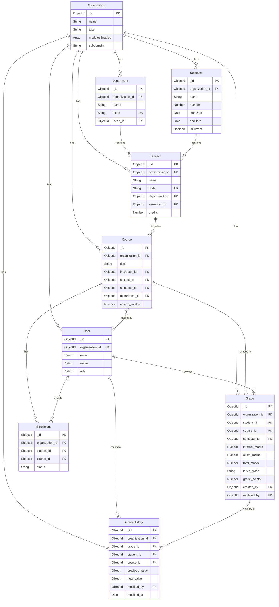

# Design Document: College Academic Layer

## Overview

The College Academic Layer feature extends the existing multi-tenant LMS platform with comprehensive academic management capabilities specifically for organizations with type "COLLEGE". This feature introduces a hierarchical academic structure (Departments → Semesters → Subjects → Courses) and provides gradebook functionality, transcript generation, GPA/CGPA calculation, and attendance tracking tailored for higher education institutions.

### Key Design Principles

1. **Strict Tenant Isolation**: All academic data is scoped by organizationId with middleware-level enforcement
2. **Backward Compatibility**: Existing functionality for School, Institute, and Online Academy organization types remains unchanged
3. **Module-Based Visibility**: Features are conditionally displayed based on the modulesEnabled array in Organization configuration
4. **Non-Breaking Extensions**: Course model is extended with optional academic fields; existing courses continue to function without modification
5. **Consistent Grade Calculation**: Unified grade point mapping and GPA formulas across all academic calculations

### Scope

**In Scope:**
- Department, Semester, and Subject data models with full CRUD operations
- Course extensions for academic context (subjectId, semesterId, departmentId, credits)
- Gradebook module for instructors with grade entry and calculation
- Student academic overview dashboard with GPA and attendance summaries
- Academic transcript generation with semester-wise grade display
- Attendance tracking and threshold monitoring (75% minimum)
- Audit trail for grade modifications
- Module-based feature visibility controls

**Out of Scope:**
- Degree program management and curriculum planning
- Course prerequisite enforcement
- Academic calendar and registration workflows
- Financial aid and scholarship management
- Faculty workload and scheduling optimization
- Integration with external student information systems

## Architecture

### System Architecture

The College Academic Layer follows the existing three-tier architecture:

```
┌─────────────────────────────────────────────────────────────┐
│                     Client Layer (Next.js)                   │
│  ┌──────────────┐  ┌──────────────┐  ┌──────────────┐      │
│  │   Instructor │  │    Student   │  │  Org Admin   │      │
│  │  Gradebook   │  │  Transcript  │  │  Academic    │      │
│  │   Dashboard  │  │   Dashboard  │  │  Management  │      │
│  └──────────────┘  └──────────────┘  └──────────────┘      │
└─────────────────────────────────────────────────────────────┘
                            │
                            │ HTTPS/REST API
                            ▼
┌─────────────────────────────────────────────────────────────┐
│                   Server Layer (Express.js)                  │
│  ┌──────────────────────────────────────────────────────┐   │
│  │              Middleware Layer                        │   │
│  │  • authMiddleware (JWT validation)                   │   │
│  │  • orgAccessMiddleware (tenant isolation)            │   │
│  │  • moduleGuard (feature visibility)                  │   │
│  │  • requireRole (authorization)                       │   │
│  └──────────────────────────────────────────────────────┘   │
│  ┌──────────────────────────────────────────────────────┐   │
│  │              Route Layer                             │   │
│  │  • /api/departments                                  │   │
│  │  • /api/semesters                                    │   │
│  │  • /api/subjects                                     │   │
│  │  • /api/gradebook                                    │   │
│  │  • /api/transcripts                                  │   │
│  └──────────────────────────────────────────────────────┘   │
│  ┌──────────────────────────────────────────────────────┐   │
│  │              Controller Layer                        │   │
│  │  • DepartmentController                              │   │
│  │  • SemesterController                                │   │
│  │  • SubjectController                                 │   │
│  │  • GradebookController                               │   │
│  │  • TranscriptController                              │   │
│  └──────────────────────────────────────────────────────┘   │
│  ┌──────────────────────────────────────────────────────┐   │
│  │              Service Layer                           │   │
│  │  • AcademicStructureService                          │   │
│  │  • GradebookService                                  │   │
│  │  • TranscriptService                                 │   │
│  │  • GPACalculationService                             │   │
│  │  • AttendanceAnalyticsService                        │   │
│  └──────────────────────────────────────────────────────┘   │
└─────────────────────────────────────────────────────────────┘
                            │
                            │ Mongoose ODM
                            ▼
┌─────────────────────────────────────────────────────────────┐
│                   Data Layer (MongoDB)                       │
│  ┌──────────────┐  ┌──────────────┐  ┌──────────────┐      │
│  │ Departments  │  │  Semesters   │  │   Subjects   │      │
│  └──────────────┘  └──────────────┘  └──────────────┘      │
│  ┌──────────────┐  ┌──────────────┐  ┌──────────────┐      │
│  │   Courses    │  │    Grades    │  │  Attendance  │      │
│  │  (extended)  │  │  (extended)  │  │              │      │
│  └──────────────┘  └──────────────┘  └──────────────┘      │
│  ┌──────────────┐  ┌──────────────┐                        │
│  │ GradeHistory │  │     Users    │                        │
│  └──────────────┘  └──────────────┘                        │
└─────────────────────────────────────────────────────────────┘
```

### Data Flow

#### Gradebook Entry Flow
```
Instructor → Gradebook UI → POST /api/gradebook/grades
    ↓
authMiddleware (validate JWT)
    ↓
requireRole(['instructor'])
    ↓
orgAccessMiddleware (verify organizationId)
    ↓
GradebookController.createGrade()
    ↓
GradebookService.validateInstructorAssignment()
    ↓
GradebookService.calculateGrade()
    ↓
Grade.save() + GradeHistory.create()
    ↓
GPACalculationService.recalculateStudentGPA()
    ↓
Response with calculated grade
```

#### Transcript Generation Flow
```
Student → Transcript Page → GET /api/transcripts/my-transcript
    ↓
authMiddleware (validate JWT)
    ↓
requireRole(['student'])
    ↓
TranscriptController.getMyTranscript()
    ↓
TranscriptService.fetchGradesBySemester()
    ↓
GPACalculationService.calculateSemesterGPA()
    ↓
GPACalculationService.calculateCGPA()
    ↓
Response with formatted transcript data
```

### Security Architecture

1. **Authentication Layer**: JWT-based authentication via authMiddleware
2. **Authorization Layer**: Role-based access control via requireRole middleware
3. **Tenant Isolation Layer**: organizationId filtering via orgAccessMiddleware
4. **Module Visibility Layer**: Feature flags via moduleGuard middleware
5. **Data Validation Layer**: Mongoose schema validation and custom validators

## Components and Interfaces

### Backend Components

#### 1. Models

##### Department Model (Existing - No Changes Required)
```javascript
{
  organization_id: ObjectId (required, indexed),
  name: String (required),
  code: String (required, unique per org),
  head_id: ObjectId (ref: User),
  description: String,
  isActive: Boolean,
  timestamps: true
}
```

##### Semester Model (Existing - No Changes Required)
```javascript
{
  organization_id: ObjectId (required, indexed),
  name: String (required),
  number: Number (required),
  startDate: Date,
  endDate: Date,
  isCurrent: Boolean,
  timestamps: true
}
```

##### Subject Model (Existing - No Changes Required)
```javascript
{
  organization_id: ObjectId (required, indexed),
  name: String (required),
  code: String (required, unique per org),
  department_id: ObjectId (ref: Department),
  semester_id: ObjectId (ref: Semester),
  credits: Number,
  description: String,
  isActive: Boolean,
  timestamps: true
}
```

##### Course Model Extensions (Modify Existing)
```javascript
// Add these fields to existing Course schema
{
  // ... existing fields ...
  subject_id: ObjectId (ref: Subject, optional),
  semester_id: ObjectId (ref: Semester, optional),
  department_id: ObjectId (ref: Department, optional),
  course_credits: Number (default: 0)
}
```

##### Grade Model Extensions (Modify Existing)
```javascript
// Add these fields to existing Grade schema
{
  // ... existing fields ...
  semester_id: ObjectId (ref: Semester, optional),
  internal_marks: Number (for assignments/quizzes),
  exam_marks: Number (for final exam),
  total_marks: Number (calculated),
  letter_grade: String (A/B/C/F),
  grade_points: Number (4.0 scale),
  created_by: ObjectId (ref: User),
  modified_by: ObjectId (ref: User),
  modified_at: Date
}
```

##### GradeHistory Model (New)
```javascript
{
  organization_id: ObjectId (required, indexed),
  grade_id: ObjectId (ref: Grade, required),
  student_id: ObjectId (ref: User, required),
  course_id: ObjectId (ref: Course, required),
  semester_id: ObjectId (ref: Semester),
  previous_value: {
    internal_marks: Number,
    exam_marks: Number,
    total_marks: Number,
    letter_grade: String,
    grade_points: Number
  },
  new_value: {
    internal_marks: Number,
    exam_marks: Number,
    total_marks: Number,
    letter_grade: String,
    grade_points: Number
  },
  modified_by: ObjectId (ref: User, required),
  modified_at: Date (required),
  reason: String,
  timestamps: true
}

// Indexes
{ organization_id: 1, grade_id: 1, modified_at: -1 }
{ organization_id: 1, student_id: 1, modified_at: -1 }
```

#### 2. Services

##### AcademicStructureService
```javascript
class AcademicStructureService {
  // Department operations
  async createDepartment(data, organizationId)
  async updateDepartment(id, data, organizationId)
  async deleteDepartment(id, organizationId)
  async getDepartments(organizationId, filters)
  async validateDepartmentCode(code, organizationId, excludeId)
  
  // Semester operations
  async createSemester(data, organizationId)
  async updateSemester(id, data, organizationId)
  async deleteSemester(id, organizationId)
  async getSemesters(organizationId, filters)
  async getCurrentSemester(organizationId)
  async validateSemesterDates(startDate, endDate)
  
  // Subject operations
  async createSubject(data, organizationId)
  async updateSubject(id, data, organizationId)
  async deleteSubject(id, organizationId)
  async getSubjects(organizationId, filters)
  async validateSubjectCode(code, organizationId, excludeId)
  async linkSubjectToCourse(subjectId, courseId, organizationId)
}
```

##### GradebookService
```javascript
class GradebookService {
  async getInstructorCourses(instructorId, organizationId)
  async getCourseStudents(courseId, organizationId)
  async createGrade(gradeData, instructorId, organizationId)
  async updateGrade(gradeId, gradeData, instructorId, organizationId)
  async getStudentGrades(studentId, courseId, organizationId)
  async validateInstructorAssignment(instructorId, courseId)
  async calculateGrade(internalMarks, examMarks, maxMarks)
  async bulkCreateGrades(gradesArray, instructorId, organizationId)
}
```

##### GPACalculationService
```javascript
class GPACalculationService {
  async calculateSemesterGPA(studentId, semesterId, organizationId)
  async calculateCGPA(studentId, organizationId)
  async getGradePoints(letterGrade)
  async mapPercentageToGrade(percentage)
  async recalculateStudentGPA(studentId, organizationId)
  
  // Grade point mapping
  gradePointMap = {
    'A': 4.0,
    'B': 3.0,
    'C': 2.0,
    'F': 0.0
  }
  
  // Grade thresholds
  gradeThresholds = {
    'A': 90,
    'B': 75,
    'C': 60,
    'F': 0
  }
}
```

##### TranscriptService
```javascript
class TranscriptService {
  async generateTranscript(studentId, organizationId)
  async getGradesBySemester(studentId, organizationId)
  async formatTranscriptData(grades, semesters)
  async calculateTranscriptSummary(studentId, organizationId)
}
```

##### AttendanceAnalyticsService
```javascript
class AttendanceAnalyticsService {
  async getInstructorAttendanceSummary(instructorId, organizationId)
  async getStudentAttendanceSummary(studentId, organizationId)
  async getStudentsBelowThreshold(courseId, threshold, organizationId)
  async calculateCourseAttendance(studentId, courseId, organizationId)
  async calculateOverallAttendance(studentId, organizationId)
  
  ATTENDANCE_THRESHOLD = 75 // percentage
}
```

#### 3. Controllers

##### DepartmentController
```javascript
class DepartmentController extends BaseController {
  async create(req, res)      // POST /api/departments
  async getAll(req, res)       // GET /api/departments
  async getById(req, res)      // GET /api/departments/:id
  async update(req, res)       // PUT /api/departments/:id
  async delete(req, res)       // DELETE /api/departments/:id
}
```

##### SemesterController
```javascript
class SemesterController extends BaseController {
  async create(req, res)       // POST /api/semesters
  async getAll(req, res)       // GET /api/semesters
  async getById(req, res)      // GET /api/semesters/:id
  async getCurrent(req, res)   // GET /api/semesters/current
  async update(req, res)       // PUT /api/semesters/:id
  async delete(req, res)       // DELETE /api/semesters/:id
}
```

##### SubjectController
```javascript
class SubjectController extends BaseController {
  async create(req, res)       // POST /api/subjects
  async getAll(req, res)       // GET /api/subjects
  async getById(req, res)      // GET /api/subjects/:id
  async update(req, res)       // PUT /api/subjects/:id
  async delete(req, res)       // DELETE /api/subjects/:id
  async linkToCourse(req, res) // POST /api/subjects/:id/link-course
}
```

##### GradebookController
```javascript
class GradebookController extends BaseController {
  async getMyCourses(req, res)           // GET /api/gradebook/my-courses
  async getCourseStudents(req, res)      // GET /api/gradebook/courses/:id/students
  async createGrade(req, res)            // POST /api/gradebook/grades
  async updateGrade(req, res)            // PUT /api/gradebook/grades/:id
  async getStudentGrades(req, res)       // GET /api/gradebook/students/:id/grades
  async bulkCreateGrades(req, res)       // POST /api/gradebook/grades/bulk
  async getGradeHistory(req, res)        // GET /api/gradebook/grades/:id/history
}
```

##### TranscriptController
```javascript
class TranscriptController extends BaseController {
  async getMyTranscript(req, res)        // GET /api/transcripts/my-transcript
  async getStudentTranscript(req, res)   // GET /api/transcripts/students/:id
}
```

### Frontend Components

#### 1. Instructor Components

##### GradebookDashboard
```typescript
interface GradebookDashboardProps {
  instructorId: string;
  organizationId: string;
}

// Displays:
// - List of instructor's courses
// - Attendance summary widget
// - Quick access to grade entry
```

##### CourseGradebook
```typescript
interface CourseGradebookProps {
  courseId: string;
  courseName: string;
}

// Features:
// - Student list with enrollment info
// - Grade entry form (internal marks, exam marks)
// - Auto-calculated totals and letter grades
// - Bulk grade entry option
// - Grade history view
```

##### AttendanceSummaryWidget
```typescript
interface AttendanceSummaryWidgetProps {
  instructorId: string;
  organizationId: string;
}

// Displays:
// - Students below 75% threshold (highlighted in red)
// - Course-wise attendance breakdown
// - Quick filters by course
```

##### CourseAcademicInfoPanel
```typescript
interface CourseAcademicInfoPanelProps {
  course: Course;
}

// Displays (read-only):
// - Subject name and code
// - Credits
// - Semester name
// - Department name
```

#### 2. Student Components

##### AcademicOverviewWidget
```typescript
interface AcademicOverviewWidgetProps {
  studentId: string;
  semesterId?: string;
}

// Displays:
// - Current semester name
// - Total credits enrolled
// - Current GPA
// - Overall attendance percentage
```

##### TranscriptPage
```typescript
interface TranscriptPageProps {
  studentId: string;
}

// Features:
// - Semester-wise grade display
// - Course details (name, credits, marks, grade)
// - Semester GPA for each semester
// - Cumulative CGPA
// - Chronological ordering
// - Print/export functionality
```

##### StudentAttendancePage
```typescript
interface StudentAttendancePageProps {
  studentId: string;
}

// Displays:
// - Course-wise attendance percentage
// - Courses below 75% highlighted in red
// - Total classes vs attended classes
// - Attendance trend chart
```

##### SemesterFilterDropdown
```typescript
interface SemesterFilterDropdownProps {
  organizationId: string;
  currentSemesterId: string;
  onSemesterChange: (semesterId: string) => void;
}

// Features:
// - Dropdown with all semesters
// - Default to current semester
// - Updates dashboard data on selection
```

#### 3. Org Admin Components

##### DepartmentManagement
```typescript
interface DepartmentManagementProps {
  organizationId: string;
}

// Features:
// - Department list with CRUD operations
// - Department code validation
// - Linked subjects count
// - Delete protection for departments with subjects
```

##### SemesterManagement
```typescript
interface SemesterManagementProps {
  organizationId: string;
}

// Features:
// - Semester list with CRUD operations
// - Date range validation
// - Current semester indicator
// - Delete protection for semesters with subjects/courses
```

##### SubjectManagement
```typescript
interface SubjectManagementProps {
  organizationId: string;
}

// Features:
// - Subject list with CRUD operations
// - Department and semester selection
// - Credits validation
// - Linked courses count
// - Delete protection for subjects with courses
```

##### CourseSubjectMapping
```typescript
interface CourseSubjectMappingProps {
  courseId: string;
  organizationId: string;
}

// Features:
// - Subject selection dropdown
// - Auto-populate semester, department, credits
// - Unlink option
// - Academic info preview
```

### API Endpoints

#### Department Endpoints
```
POST   /api/departments                    Create department
GET    /api/departments                    List departments
GET    /api/departments/:id                Get department details
PUT    /api/departments/:id                Update department
DELETE /api/departments/:id                Delete department
```

#### Semester Endpoints
```
POST   /api/semesters                      Create semester
GET    /api/semesters                      List semesters
GET    /api/semesters/current              Get current semester
GET    /api/semesters/:id                  Get semester details
PUT    /api/semesters/:id                  Update semester
DELETE /api/semesters/:id                  Delete semester
```

#### Subject Endpoints
```
POST   /api/subjects                       Create subject
GET    /api/subjects                       List subjects
GET    /api/subjects/:id                   Get subject details
PUT    /api/subjects/:id                   Update subject
DELETE /api/subjects/:id                   Delete subject
POST   /api/subjects/:id/link-course       Link subject to course
```

#### Gradebook Endpoints
```
GET    /api/gradebook/my-courses           Get instructor's courses
GET    /api/gradebook/courses/:id/students Get course students
POST   /api/gradebook/grades               Create grade
PUT    /api/gradebook/grades/:id           Update grade
GET    /api/gradebook/students/:id/grades  Get student grades
POST   /api/gradebook/grades/bulk          Bulk create grades
GET    /api/gradebook/grades/:id/history   Get grade history
```

#### Transcript Endpoints
```
GET    /api/transcripts/my-transcript      Get my transcript
GET    /api/transcripts/students/:id       Get student transcript (admin/instructor)
```

#### Attendance Analytics Endpoints
```
GET    /api/attendance/instructor/summary  Get instructor attendance summary
GET    /api/attendance/student/summary     Get student attendance summary
GET    /api/attendance/courses/:id/below-threshold  Get students below threshold
```

## Data Models

### Entity Relationship Diagram



### Data Validation Rules

#### Department
- `name`: Required, 2-100 characters
- `code`: Required, unique within organizationId, uppercase, 2-10 characters
- `organization_id`: Required, must exist
- `head_id`: Optional, must be a user with role 'instructor' in same organization

#### Semester
- `name`: Required, 2-50 characters
- `number`: Required, positive integer
- `startDate`: Required, must be a valid date
- `endDate`: Required, must be after startDate
- `organization_id`: Required, must exist

#### Subject
- `name`: Required, 2-100 characters
- `code`: Required, unique within organizationId, uppercase, 2-15 characters
- `credits`: Required, positive number, typically 1-6
- `department_id`: Required, must exist in same organization
- `semester_id`: Required, must exist in same organization
- `organization_id`: Required, must exist

#### Grade
- `student_id`: Required, must be a user with role 'student' in same organization
- `course_id`: Required, must exist in same organization
- `internal_marks`: Required, non-negative number
- `exam_marks`: Required, non-negative number
- `total_marks`: Calculated as internal_marks + exam_marks
- `letter_grade`: Calculated based on percentage
- `grade_points`: Calculated based on letter_grade
- `semester_id`: Optional, must exist in same organization if provided
- `organization_id`: Required, must exist

### Database Indexes

```javascript
// Department
{ organization_id: 1, code: 1 } unique
{ organization_id: 1, isActive: 1 }

// Semester
{ organization_id: 1, number: 1 }
{ organization_id: 1, isCurrent: 1 }
{ organization_id: 1, startDate: 1, endDate: 1 }

// Subject
{ organization_id: 1, code: 1 } unique
{ organization_id: 1, department_id: 1 }
{ organization_id: 1, semester_id: 1 }
{ organization_id: 1, isActive: 1 }

// Course (new indexes)
{ organization_id: 1, subject_id: 1 }
{ organization_id: 1, semester_id: 1 }
{ organization_id: 1, department_id: 1 }

// Grade (new indexes)
{ organization_id: 1, semester_id: 1, student_id: 1 }
{ organization_id: 1, course_id: 1, student_id: 1 }

// GradeHistory
{ organization_id: 1, grade_id: 1, modified_at: -1 }
{ organization_id: 1, student_id: 1, modified_at: -1 }
{ organization_id: 1, course_id: 1, modified_at: -1 }
```

